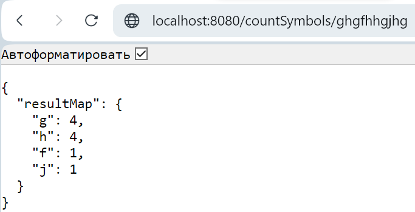

# CountSymbolsFrequency
## Описание проекта

Проект REST API-приложения, вычисляющего частоту встречи символов по заданной строке.

## Ограничения входящих и исходящих параметров
Для корректного отображения резузльтатов поиска в качестве символов входящей строки могут использоваться:
- символы латинского алфавита;
- цифры;
- знаки препинания.

Результатом работы программы является объект resultMap с типом данных LinkedHashMap, 
где в качестве ключей - символы, а значений - частота их вхождения в заданную строку.
Результат отсортирован по убыванию количества вхождений символа в заданную строку.
```yaml
{ 
  "resultMap": {
    "a": 5,
    "c": 4,
    "b": 1
  }
}
```

## Инструкция по локальному запуску проекта
Выполнить сборку проекта Maven -> counterfreq -> Lifecycle -> package. После сборки проекта запустить его из окна 
терминала, выполнив команды:
```bash
cd target
java -jar CounterSymbolsFrequency-0.0.1-SNAPSHOT.jar
```
Либо после сборки проекта создать образ Docker командой:
```bash
docker build --tag=counterfreq:latest .
```
и затем выполнить запуск контейнера:
```bash
docker run -d --name=counterEngine -p 7777:8080 counterfreq:latest
```

Перейти в браузере на адресную строку "http://localhost:8080/countSymbols/" (при запуке из терминала) 
или "http://localhost:7777/countSymbols/" (при запуске Docker-контейнера) и ввести строку для определения частоты 
вхождения тех или иных символов, как показано на скрине ниже:



## Стек используемых технологий
В данном проекте используются:
* Java 17
* Spring Boot 3.1.0
* Lombok
* Maven
* Docker